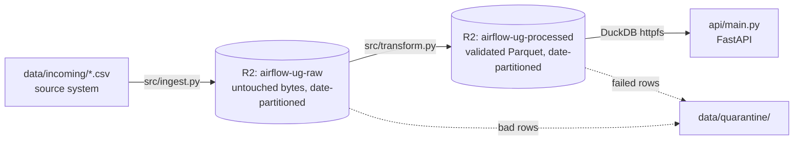

# Architecture

## Data flow

`Makefile`'s `run` target chains ingest → transform. GitHub Actions (`.github/workflows/pipeline.yml`) runs that same target hourly via cron and on manual dispatch, so the schedule proves the pipeline reproduces from a clean environment every run, not just on one developer's machine.

## Why two storage zones, not one

- **`airflow-ug-raw`** is the landing zone. `ingest.py` copies the source file in byte-for-byte, stamping `ingested_at`/`source_file` as object metadata rather than mutating the file. Nothing here is ever assumed to be clean.
- **`airflow-ug-processed`** is the output of validation and transformation — the only thing downstream consumers (API, dashboard) ever read.

`transform.py` only ever reads from raw and writes to processed; it has no path back into raw. That one-way flow is what makes the raw zone a reliable fallback: if a bug is found in the transform logic after the fact, wipe `processed/` and rerun against `raw/` — the source system never needs to be touched again.

## Idempotency

Two different mechanisms, one per stage:

- **Ingest** — before uploading, `head_object` checks whether `date=<run_date>/<filename>` already exists in the raw bucket. If it does, the file is skipped. Re-running ingestion on the same day is a no-op.
- **Transform** — each run overwrites the single object at `date=<run_date>/readings.parquet` in the processed bucket, rather than appending. Re-running transform against the same raw inputs produces the same row count and same values every time (verified by `make chaos`'s test 3, which reruns transform twice back-to-back and asserts row counts match: 121,641 rows both times against the real dataset).

Note: "same data" does not mean "byte-identical Parquet file" — Parquet embeds write-time metadata that can differ across runs even when the row-level content is identical. The guarantee that matters here is content-identical, not hash-identical.

## Schema resilience (the actual hard part)

The raw source is a wide table (one row per timestamp, one column per sensor parameter). `transform.py` melts it into a long table (`sensor_id, timestamp, parameter, value, unit`) and maps each known raw column name to a clean parameter name via `src/schemas.py::KNOWN_PARAMETERS`. That mapping is what makes schema drift survivable instead of fatal:

| Drift scenario | Behavior | Why |
|---|---|---|
| Source adds a new column | Logged as unrecognized, ignored | It isn't in `KNOWN_PARAMETERS`, so it's excluded from the melt — never reaches validation |
| Source drops an expected column | Logged as missing, remaining columns processed normally | The melt only operates on columns present in the file; an absent one simply contributes no rows for that parameter |
| A row's Date/Time is unparseable | Row is quarantined to `data/quarantine/<date>.csv` with a reason, excluded from output | Corrupt timestamps can't be assigned a natural key, so they can't be safely written |
| A row fails the pandera schema after transformation | Row is quarantined with reason `schema validation failed`, remaining rows still written | One bad row shouldn't fail an entire run |

All four scenarios are exercised for real (against live R2 buckets, not mocks) by `scripts/chaos_test.py` — run it with `make chaos`.

## Serving

`src/query.py` configures a single cached DuckDB connection with the `httpfs` extension pointed at the R2 S3-compatible endpoint. `api/main.py` builds parameterized SQL (never string-interpolated user input) against `read_parquet('s3://airflow-ug-processed/*/*.parquet')` — no database server to provision or manage, and querying automatically spans every date partition ever written.
